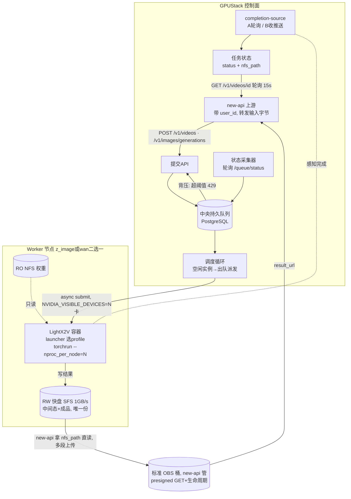

# 将 LightX2V 封装为 GPUStack 推理后端 — 完整设计文档

> 目标读者:在 GPUStack fork 上把视频/图像生成引擎 **LightX2V** 接入为可调度后端的团队。
> 配套阅读:[`secondary-development-pipeline.md`](./secondary-development-pipeline.md)(出包/镜像流水线)。
> 本文是**设计文档**(只描述方案与依据,不含最终落地代码)。

---

## 0. 决策摘要(已拍板)

| 项 | 决策 |
|---|---|
| 接入方式 | **Custom 后端直接用于生产**(镜像内 launcher 承载全部引擎逻辑);分阶段只分功能:**Phase A** 跑通最短链路 → **Phase B** 生产 dispatcher。内置后端化已取消(2026-07-02,见 §13) |
| 交互模型 | 核心**异步队列**(生成可达 10 分钟级);对外**异步轮询为主**、**图片可同步**、**回调可选**(§2.4 核验:new-api 是轮询式接入) |
| 对外 API | **OpenAI 兼容门面为主**(`/v1/videos` 作业式可轮询、`/v1/images/generations` 同步),同走一队列;new-api 加 channel+`TaskAdaptor` 轮询接入(仿 Sora);回调可选(§6.9) |
| 输入交付 | **B 方案**:new-api 无对象存储、转发字节 → GPUStack 收 base64/multipart 落 NFS(§7.7) |
| 任务队列 | **中央持久队列 = PostgreSQL**(现自带、将来 RDS 主备),先入队再调度进空闲实例(D1 重方案,§6.5) |
| 背压/限流 | **每模型可配置阈值**,积压超阈值拒绝新任务(D2) |
| 完成通知 | **内部** completion-source(§6.4):**Phase 1 图片+视频都用 A 轮询**(零改 LightX2V,复用 tasks 状态接口),**后续按需升级 B 推送**;与对外交付解耦 |
| new-api 接入 | **不改动,用现状**:视频走 new-api 既有 `/v1/videos` **轮询(15s,`task_polling.go:93`)**;图片走**同步** relay(无轮询延迟) |
| 内存上限 | deployer 不支持(§2.4)→ 靠 int8 规避 + bf16 多卡禁用 + worker docker 层兜底(§8.2) |
| 弹性卡数 | 节点 z_image / wan **二选一**;每节点 `replicas × gpus_per_replica = 4` 布局;dispatcher 对布局无感 |
| 结果存储 | **GPUStack 只写 NFS,状态返回 `nfs_path`(内网);OBS 全部能力归 new-api**(读 NFS→传 OBS→presigned,§7.3/§7.8);GPUStack 保 OpenAI 兼容(`/content` 流式 NFS、图片 b64) |
| user_id | 来自 **new-api**(非 GPUStack 用户体系),缺省 `0` |

---

## 0.1 实现状态(2026-07-03 更新)

**new-api 侧 OBS 媒体存储已实现并上线。** 本文中所有"new-api 需新建 / 无对象存储 / day-one"的表述以此节为准更新(下文历史描述保留作设计依据):

- **设计与实现**:见 new-api 仓 `docs/media-storage-obs-design.md`(v1.4)。
- **已落地能力**:MediaStore(S3 兼容 OBS,AK/SK 加密入库 + 环境变量优先,presigned GET,§7.2 同款对象键)· `nfs_path` 读盘上传(自建 GPUStack 成品)· 第三方上游 URL 下载重传(统一入库,§7.8)· `obs://` 占位符落库、序列化层实时签名(永不落库)· 7 天生命周期(HCSO 桶级规则)· 桶用量监控/告警。
- **渠道形态**:落地为 **GPUStackPlus 渠道(ChannelType=59)**——视频走任务子系统 `TaskAdaptor`(轮询 15s)、图片走同步 relay;成品统一落 OBS、对外只发签名 URL。§6.9/§7.8 早先"仿 sora channel"的设想即由此实现。
- **交付路径(方案 B 落地)**:new-api 提交时拼含 `user_id` 的 `save_result_path`(§7.2 约定)并 `mkdir` 父目录(BMS **读写**挂载 SFS),上游据此写文件;完成后读 `nfs_path` → 上传 OBS → presigned。建目录由 new-api 做,不违背"SFS 对计算节点只读"设计。
- **生产部署**:BMS `bms-newapi` 已挂 `100.125.40.2:/share-output → /nfs-output`(rw,`_netdev,nofail`);OBS 桶 `maas-obs-output`(endpoint `obs.cn-central-221.ovaijisuan.com`,region `cn-central-221`,私有 + 7 天生命周期);后台已启用并通过 PutObject/DeleteObject 连通性校验;图片生成/复制/下载已验证。
- **一处安全修复**:隔离环境下 OBS 内网域名解析到 `100.64/10`(CGNAT)被通用 SSRF 误判私网 → 改为 validator 级 host 白名单精准放行(仅放松"我方 OBS 域名解析到私网"这一条,scheme/端口/黑白名单仍强制)。

> GPUStack 侧(launcher / dispatcher / 中央队列)不在本次更新范围,仍以下文设计为准。

---

## 1. 背景与目标

把 LightX2V 接入 GPUStack,使其作为**可调度的推理后端**。硬件:每节点 **4×A100 40GB(鲲鹏 ARM,无 NVLink)**;**现 4 节点(16 卡),未来可达 300 节点(1200 卡)**(扩展性见 §6.6)。先做**生图(Z-Image)**,再做**生视频(Wan2.2-I2V)**,后续扩展同框架其它模型。要支持:

- 同一引擎按需 **1 / 2 / 4 卡**(视频多卡 Ulysses/TP;单卡 CPU offload);
- 异步 + 中央队列 + 负载均衡 + 背压限流(完成感知:内部 A 轮询起步、B 推送可插拔,§6.4;对外轮询为主、回调可选,§6.9);
- 结果落**快盘 NFS**、接口返回 `nfs_path`;**OBS 入库与对外下载 URL 由 new-api 负责**(§7.3;早期"NFS+OBS 双写"已改判)。

---

## 2. 关键事实(已核实)

### 2.1 LightX2V 引擎

| 维度 | 事实 |
|---|---|
| HTTP server | 自带:`python -m lightx2v.server`(FastAPI/uvicorn,默认 8000) |
| API | **异步任务队列、非 OpenAI**:`POST /v1/tasks/{image,video}/` → `task_id` → 轮询 `GET /v1/tasks/{id}/status` → `GET /v1/tasks/{id}/result`;另有 `/v1/tasks/image/sync`(内部 submit+等待+可上传 presigned)、`/v1/tasks/queue/status`、`cancel` |
| 多卡 | **torchrun 直接拉起 server**:`torchrun --nproc_per_node=N -m lightx2v.server --cfg_p_size X --seq_p_size Y --seq_p_attn_type ulysses`。约束 `cfg_p_size × seq_p_size == N`(或 `tensor_p_size == N`)。rank0 跑 HTTP,其余 rank 跑 worker loop |
| 单卡 offload | config `cpu_offload=true, offload_granularity=block(MoE 必须 model), t5_cpu_offload, vae_cpu_offload` |
| 任务状态 | **进程内**(in-memory OrderedDict 单例),task_id 只在创建它的实例有效 → **实例亲和是硬约束** |
| 回调/对象存储 | **原生无回调**;presigned 上传**仅接在** `/v1/tasks/image/sync`,异步路径会丢弃 `presigned_url` |
| 集群能力 | **无**。redis/asyncpg/pymongo 是未使用的幽灵依赖;disagg/Mooncake 是"单次推理拆三段",非多实例分发 |
| 运行时 | torch≤2.8;arm64 镜像;可选 `lightx2v_kernel`(nvfp4 需 CUTLASS 编译) |

### 2.2 GPUStack

- 引擎以**容器**运行(`gpustack_runtime` deployer);调度分配的 `gpu_indexes` 经 `NVIDIA_VISIBLE_DEVICES` 注入容器 → 单 worker 单容器多卡天然支持。
- Custom 后端 run_command 占位符:`{{model_path}} {{port}} {{worker_ip}} {{model_name}} {{ENV}}`;可配 `image_name/entrypoint/env/backend_parameters/health_check_path`。
- 到实例的转发只有 `routes/openai.py::proxy_request_by_model` 一条成熟路径;**无通用透传**(`routes/proxy.py` 仅外链代理)。`CategoryEnum` 无 `video`,`openai_model_prefixes` 无 `/v1/tasks/*`。
- 复用件:`get_running_instances`、`http_proxy/load_balancer.py`、collector 模式(`metrics_collector.py`/`worker_status_buffer.py`)、`bus.py` 事件总线、`websocket_proxy/message_server.py`、APScheduler。

### 2.3 OBS(华为云对象存储)

- S3 风格、AK/SK 签名;**presigned PUT/GET** 都支持,`Expires` 为**绝对 UTC epoch 秒**;**多段上传**;`obsutil cp/sync` 增量镜像。
- **标准桶支持生命周期**(定时自动删对象);**PFS** 高性能 POSIX(TB/s)但**不保证生命周期**且挂载需 obsfs(本批手册未覆盖)。
- 性能判断:对象上传是**并发聚合带宽**,单流受网络限;几百 MB 视频 2–4s 上传,**不在关键路径**;快盘(SFS/PFS)才适合低时延中间态共享。

### 2.4 跨仓代码核验(2026-06,实读 gpustack_runner / gpustack-ui / new-api)

| 仓 | 核验结论 | 对设计的影响 |
|---|---|---|
| **gpustack_runtime deployer** | `WorkloadPlan`/`Container` **只有 `shm_size`,无硬内存上限**(无 `--memory`);`ContainerMount` 支持**多个、同路径 host bind**(`ContainerMount(path="/nfs-rw")`);arm64/amd64 自动选;自定义引擎走 `CustomServer`(不进 `list_backend_runners`) | **修正 §8.2**:内存上限 GPUStack 设不了 → worker docker 层/容器内自限/靠 int8。**确认 §10**:RW NFS 挂载靠加 `ContainerMount` ✓ |
| **gpustack-ui**(UmiJS+React+antd) | **Video 体验区已实现、仅被注释**(`config/routes.ts:81-91`),调 `POST /v1/videos`;Image 体验区调 `/v1/images/generations`(同步,`stream:false`,渲染 `data.data[]`);模型部署页按后端 `common_parameters` 动态渲染参数;存储设置可仿 `cluster-management/credentials`、`gpu-service/storage`;任务面板可仿 `resources/components/workers.tsx`(`useTableFetch` + `watch:true` 实时) | **确认 §6.9/§9**:`/v1/videos`+`/v1/images/generations` 选型踩对;**Video tab 取消注释即可**,UI 工作量极小 |
| **new-api**(Go,one-api fork) | **已有成熟异步媒体任务子系统**:`TaskAdaptor` 接口 + `Task` 表 + 后台 `FetchTask` **轮询** + 计费;已暴露 `POST /v1/videos`、`GET /v1/videos/:id`、`/remix`(Sora/Kling/Vidu/即梦…);图片走 `Adaptor.ConvertImageRequest` 同步;**无对象存储**——收 multipart/base64 → **转发字节给上游**,上游存储回 URL;上游鉴权用 channel `Key`(Bearer);用户标识 `Task.UserId`(int) | **修正 §7.7**:输入走 **B**(new-api 转发字节,GPUStack 存)。**修正 §6.9**:new-api **轮询**接入(非回调)→ 回调降级为可选;集成 = 加 GPUStack channel+TaskAdaptor 指向 `/v1/videos` |

> **核心收获**:GPUStack 只要把自己做成"**像 Sora 一样的可轮询 `/v1/videos` 上游**",new-api 用既有 TaskAdaptor 机制即可接入,终端用户复用 new-api 的异步 UX。**OpenAI 兼容门面是主接口;回调是可选优化**。

---

## 3. 实测标定(来自两份实验报告)— 设计的事实地基

> 平台:4×A100 PCIE 40GB(无 NVLink)· 鲲鹏 ARM。**必改通用配置**:`rope_type=torch`、`attn_type=sage_attn2`(A100 跑不了 flash_attn3)。

### 3.1 两款模型要的部署形态**完全相反**

| 维度 | **Z-Image(生图,先做)** | **Wan2.2-I2V(生视频,后做)** |
|---|---|---|
| 生产最优 | **bf16 单卡 7.6s/张**(显存 21.8G/40G,宽裕) | **int8 4卡 ulysses**(480p 36s / 720p 87s) |
| 多卡 | ❌ 单图仅 1.2×,4卡不可用(30 head 不整除) | ✅ 刚需,线性提速且摊薄激活 |
| int8 | ❌ 慢 2.9×,省的 6G 用不上 | ✅ 一等公民(bf16 多卡直接 CPU OOM:4×复制 276G>256G) |
| 吞吐 | **N×单卡实例 + 负载均衡**(4 单卡 0.530 img/s) | 单实例 4 卡 |
| 端点 | `/v1/tasks/image/` | `/v1/tasks/video/` |
| 特殊 | autotune 缓存跨分辨率保留 → **启动预热全分辨率即恒热**;**别按分辨率绑实例** | 720p 开关 `resize_mode=null`;480p≤15s / 720p≤10s;flf2v≤8s(画质限) |

**结论**:抛弃"按卡数自动猜策略",改为**按模型加载实测标定好的 profile**。卡数只是 profile 的一个维度。

### 3.2 profile(实测固化,存镜像内 YAML,可覆盖)

| profile | 卡 | 关键配置 |
|---|---|---|
| `z-image/bf16`(默认) | 1 | bf16、steps=9、`enable_cfg=false`、`attn=sage_attn2`、`rope=torch` |
| `wan2.2-i2v/int8-4card`(默认) | 4 | int8-torchao、`seq_p_size=4 ulysses`、high/low MoE ckpt、`t5_cpu_offload=true`、`resize_mode=null` |
| `wan2.2-i2v/int8-1card-480p` | 1 | int8 单卡(480p,慢,低配回退) |
| `wan2.2-i2v/bf16-1card-offload` | 1 | bf16+`offload_granularity=model`(720p 险过) |

launcher 选 profile → 校验「并行乘积 == 分配卡数」→ 生成 config → 起 server;不一致**主动报错**。

---

## 4. 总体架构

三层职责:**GPUStack 控制面(队列/调度/限流/状态)** ·· **LightX2V 镜像(launcher 按卡数套 profile + 起 torchrun)** ·· **存储(快盘 NFS;OBS 交付归 new-api,§7.3)**。

```
                        ┌─────────────────────────── new-api (上游) ───────────────────────────┐
                        │  提交生成请求(带 user_id、callback_url、功能/模型/参数)                │
                        └───────────────────────────────┬──────────────────────────────────────┘
                                                         │ POST /v1/videos · /v1/images/generations (OpenAI兼容)
┌────────────────────────────── GPUStack Server(控制面) ─┼──────────────────────────────────────┐
│                                                         ▼                                       │
│   ┌─────────────┐   入队    ┌───────────────────────────────┐   背压: Σpending>阈值 → 429        │
│   │  提交 API   │ ───────▶ │  中央持久队列 (PostgreSQL)      │   (每模型可配置)                  │
│   └─────────────┘          │  task: queued→assigned→running │                                   │
│                            │        →done/failed             │                                   │
│   ┌─────────────────────┐  │  映射 central_id→(实例,原生id) │  ┌──────────────────────────────┐  │
│   │ 状态采集器(轮询各    │─▶│                                │◀─│ 调度循环:空闲实例→出队派发    │  │
│   │ 实例 /queue/status) │  └───────────────┬────────────────┘  └──────────────────────────────┘  │
│   └─────────────────────┘                  │ 派发(async submit)                                  │
│   ┌─────────────────────┐                  │            ┌──────────────────────────────────────┐ │
│   │ completion-source   │◀─────────────────┼────────────│ 任务状态: {status, nfs_path}          │ │
│   │  A:轮询 / B:收推送  │                  │            │ /content 从 NFS 流式(OpenAI 兼容)     │ │
│   └─────────────────────┘                  │            └──────────────────────────────────────┘ │
└────────────────────────────────────────────┼──────────────────────────────────────────────────────┘
                                              │ 容器内 NVIDIA_VISIBLE_DEVICES=<分配的 N 卡>
        ┌─────────────────────────────────────┴───────────────────────────────────────────┐
        │                         Worker 节点(z_image 或 wan,二选一)                       │
        │  布局: replicas × gpus_per_replica = 4                                            │
        │   z_image → 4×1卡实例     |   wan → 1×4卡实例 / 2×2卡 / 4×1卡(480p)               │
        │  ┌───────────── LightX2V 容器(每实例) ─────────────┐                              │
        │  │ entrypoint = gpustack-lx2v-launcher              │                              │
        │  │  数 GPU 数 N → 选 profile → 生成 config →         │   写结果                      │
        │  │  N==1: python -m lightx2v.server                 │ ───────────┐                 │
        │  │  N>1 : torchrun --nproc_per_node=N -m ...server  │            │                 │
        │  │  (cfg_p/seq_p/tensor_p, offload, int8)           │            ▼                 │
        │  └──────────────────────────────────────────────────┘   ┌──────────────────────┐  │
        │   只读挂载: RO NFS(权重/int8 ckpt)                       │ RW 快盘 SFS NFS 1GB/s │  │
        └──────────────────────────────────────────────────────────┤ 中间态 + 成品(唯一份)│──┘
                                                                    └───────────┬──────────┘
                          new-api(master 挂 NFS)拿 nfs_path → 直读 → 多段上传   │
                                                                                ▼
                                                                  ┌───────────────────────────┐
                                                                  │ 标准 OBS 桶(new-api 管)    │
                                                                  │ presigned GET + 生命周期清旧│
                                                                  └───────────────────────────┘
```

> Mermaid 版本(若启用 mermaid 渲染):



> 上方两幅图的端点标签为**示意**;权威接口见 §6.9(核验后):对外**统一 OpenAI 兼容端点**——`/v1/videos`(视频作业式,可轮询,状态带 `nfs_path`)、`/v1/videos/{id}/content`(NFS 流式)、`/v1/images/generations`(图片同步 b64)。new-api 以轮询式 `TaskAdaptor` 接入(非回调);**OBS 上传由 new-api 完成**(读 NFS→传 OBS,§7.3/§7.8)。new-api 转发输入字节、GPUStack 落 NFS(输入交付 B,§7.7)。

---

## 5. 弹性卡数 / 副本布局

节点 4 张卡切成不同 `(副本数 × 每副本卡数)`,约束 `replicas × gpus_per_replica = 4`:

| 布局 | 适用 | 每副本并行 |
|---|---|---|
| 4×1卡 | z_image(最优)、wan-int8-480p 低配 | 无 |
| 2×2卡 | wan `seq_p_size=2` | Ulysses 2 |
| 1×4卡 | wan `seq_p_size=4`(生产) | Ulysses 4 |

- "每副本几卡 + 并行" = profile 固定(GPUStack 按 `gpus_per_replica` 分配);"几个副本" = 部署期 replica 数。
- **dispatcher 对布局完全无感**:实例池 = 该模型在所有节点跑着的全部实例,每实例自报队列状态,LB/限流逻辑一致。

---

## 6. 异步任务 Dispatcher(队列 / 调度 / 限流 / 对外 API)

### 6.0 收敛决策(2026-07-06,实测三仓队列后)—— 本节多数是 300 节点前瞻,当前规模砍到「薄门面」

> 内置化 Phase A 真机验证通过后,实读 **LightX2V / GPUStack / new-api** 三仓队列实现,重新评估本节的「重 dispatcher」是否当前必需。结论:**大部分是 300 节点的前瞻设计,当前 4 节点规模是伪需求**,砍到「薄门面 + least-pending + 亲和映射 + 死亡重派」。M4 落地以本节为准(下文 §6.1–§6.9 保留作 300 节点扩展时的设计依据)。

**三仓队列实测(代码为证)**:
- **LightX2V 引擎**(`server/task_manager.py`):每实例**进程内 FIFO**,`active(pending+processing) ≥ max_queue_size`(GPUStack 启动设 **10**)→ 抛错 → 端点 catch 返 **HTTP 503**;有 processing lock → **一次只跑 1 个**(单卡串行)。
- **GPUStack 网关/LB**(`http_proxy/strategies.py` + `routes/openai.py`):取 **RUNNING 实例** → **`RoundRobinStrategy`**(`itertools.cycle`,**负载盲,不看队列深度**)。`openai_model_prefixes` 含 `/images/generations`/`/images/edits`,**无 `/videos`、无 `/v1/tasks/*`**。
- **new-api**(`service/task_polling.go`):relay 转发,视频建 `Task` + 后台 `FetchTask` **轮询 15s**(任务间 sleep 1s);**提交侧不自限并发**,靠上游 503 背压。

**高并发实况(100 并发 z_image `/images/generations`)**:new-api 全转 → 网关轮询摊 4 实例 → 每实例收 10、**第 11 起 503** → **约 40 收、60 被 503** → 收下的串行(7.6s/张)。四个真问题:①轮询**负载盲**(往满实例灌、不均、提前 503);②~40 在飞即 503(客户端需处理);③**`/videos` 根本没路由**(视频进不来);④**实例死→进程内队列全丢**(new-api 轮询拿 "task not found",作业静默丢失)。

**收敛后 M4 真正要做的**:
| 组件 | 现状已覆盖 | 缺口 / 要做 | 判断 |
|---|---|---|---|
| 中央 PG 队列 + SKIP-LOCKED 主调度循环 | 引擎每实例队列 + 网关轮询 | — | **砍**:主路径提交时直派,引擎队列缓冲;300 节点再上 |
| **least-pending LB**(`LeastPendingStrategy`) | round-robin(负载盲) | 选在飞最少的实例(数 M4a 表) | **做**:治问题① |
| **`/v1/videos` 门面** | 网关不路由 `/videos` | 提交/轮询/`/content`(poll-on-GET,无后台轮询器) | **做**:治问题③ |
| **亲和映射** | 无(轮询会串) | job_id→(实例,原生 id),M4a 表 | **做**:治问题①③ 的轮询串 |
| **死亡重派** | 实例 Auto-Restart(但队列已丢) | 实例死→非终态任务标回 QUEUED + 极小 sweeper 重派 | **做**:治问题④ |
| 集群级限流 429 | 引擎 503 + new-api | — | **砍**:new-api 见 503 自限流 1 分钟 |
| 提交参数校验(§6.8) | 引擎自校 + aspect bug 已修 | — | **砍**:new-api 校 |
| NFS Janitor(§7.6) | — | 清旧产物 | **推迟**:先 cron `find -mtime +7 -delete` |

> 净结果:M4 = **M4a 表 + `LeastPendingStrategy` + `/v1/videos` 薄门面(亲和映射 + 死亡重派 sweeper)**。下文 §6.1 起的重方案(中央队列骨架 / 限流 / 参数校验 / completion-source B 推送)**留作 300 节点扩展依据,当前不实现**。

### 6.1 组件(均在 GPUStack 侧)

| 组件 | 职责 | 复用 |
|---|---|---|
| 提交 API(OpenAI 兼容):`POST /v1/videos`(视频作业)· `POST /v1/images/generations`(图片同步) | 鉴权 → 背压判断 → 收输入字节落 NFS → 入中央队列 → 视频返回 job id(status=queued)、图片同步等结果 | `CurrentUserDep` |
| 中央持久队列 | task 生命周期 `queued→assigned→running→done/failed`;**持久化用 PostgreSQL**(§6.5,不用 Redis);记 `central_id→(实例,原生id,存储路径)` | 新增 SQLModel + Alembic |
| 调度循环 | 实例空闲(`active_count==0`)→ 出队 → `async submit` 到实例 → 记原生 id、转 running;**无状态,只靠 PG 队列 `FOR UPDATE SKIP LOCKED` 协调** → 可起多副本水平扩展 | APScheduler |
| 状态采集器 | **worker 本地轮询自己的实例 `/v1/tasks/queue/status`,搭 worker→server 心跳通道上报**,server 聚合 `{实例: active/pending/空闲}`,供 LB + 限流 + 可观测。**不**由 server 直接轮询每个实例(300 节点会打爆) | `worker_status_buffer.py`/`worker_syncer.py` + Prometheus |
| completion-source(可插拔) | A=轮询实例 `/status`;B=接收实例主动推送 | — |
| 状态/结果(OpenAI 兼容):`GET /v1/videos/{id}`(轮询)· `/v1/videos/{id}/content`(下载) | new-api 与外部客户端轮询取状态/结果 URL | — |
| 回调发送器(**可选**) | 完成 → `POST callback_url`;失败重试 + 死信 | `bus.py` / websocket;非 new-api 才需 |
| 集群状态 API(运维)`GET /v1/admin/lx2v/cluster/status` | 每节点每实例 忙/闲/队列深度,聚合视图(供仪表盘) | — |

### 6.2 任务亲和(D3)

原生 task_id 只在创建它的实例有效 → 后续操作必须找回原实例。**D1 中央队列的 `central_id→实例` 映射表天然解决**,客户端只用 `central_id`,无需把实例编进 id。

### 6.3 限流(D2)

每模型阈值可配(队列积压 `Σpending` 超阈值 → 429 + `Retry-After`)。z_image(7.6s)与 wan(数分钟)吞吐差异大,**分模型配置**。

**初值建议(可配,真机再调)**:每实例 LightX2V `max_queue_size` 默认 **8**;每模型集群阈值默认 **`运行实例数 × 5`**(即每实例最多积压约 5 个)。换算等待上限:z_image ≈ 8×7.6s≈1min/实例;wan ≈ 5×90s≈7.5min/实例——超此即拒,避免无限排队。

### 6.4 内部完成感知:A(轮询)vs B(推送)— 分阶段

> 这是 **GPUStack↔runner 内部**"dispatcher 怎么知道某实例的某任务做完了",**与对外接口无关**(对外按 §6.9:视频轮询 15s / 图片同步)。

| | 方案 A(零改 LightX2V) | 方案 B(小补丁) |
|---|---|---|
| 改动 | 无,**直接复用 `/v1/tasks/{id}/status` 状态接口** | `schema` 加 `callback_url`;完成 hook POST |
| 完成感知 | dispatcher/worker 轮询,**间隔默认 ~2s(可配 1–5s)** | 实例做完**即时推** dispatcher |
| 大规模(1200 实例) | 逐实例轮询有压力 | **免逐实例轮询**,最省 |

> 文件路径两方案相同:实例写共享 NFS,GPUStack 只记 `nfs_path`(§7.3,OBS 归 new-api)——B 原含的"presigned 直传 OBS"部分已随存储决策**作废**,B 瘦身为纯"完成推送",LightX2V 补丁面更小。

→ **决策(已定)**:**Phase 1 图片+视频都用 A**——**零改 LightX2V、直接复用 tasks 状态接口**,最快跑通。**后续需要提升性能时(尤其视频 / 300 节点)再优化为 B(推送)**,这正是"回调红利"所在(即时 + 免大规模逐实例轮询)。A/B 是**可插拔 completion-source**,升级不动 dispatcher 骨架,对外接口不变。

### 6.5 中央队列的 DB 选型与 HA 演进

**用 PostgreSQL,不用 Redis。** 队列是**不能丢的持久状态**,PG 事务级持久 + 主备 HA 是正解;Redis 内存为主、持久弱,与"重方案"目标相反。取任务用 `SELECT ... FOR UPDATE SKIP LOCKED`(+ 可选 `LISTEN/NOTIFY` 免轮询)。量级仅几十 ops/s,PG 绰绰有余(瓶颈是 GPU 生成,不是队列)。

**HA 演进路径(参考 new-api `docs/production-ha-migration.md`,已实操验证)**:
- 现在:GPUStack 容器**自带 PG**;
- 将来:迁**华为云 RDS PG 主备版** —— GPUStack 用 SQLAlchemy/asyncpg,**只改 `--database-url`,零改代码**(同 new-api)。
- **主备切换容错(必须)**:切换时 TCP 断、约 30s 恢复(DNS 不变,连接池重连)。dispatcher 的 DB 操作需 `pool_pre_ping` + 幂等重试(复用 GPUStack 已有 `tenacity`);队列是持久真相源 → 切换期仅短暂暂停,**任务不丢可恢复**(这正是不用 Redis 的理由)。
- **华为云 RDS 实操坑**:库名禁中划线(用下划线)· 强制 `?sslmode=require` · Alembic 首连跑迁移需 ALTER 权限 · 连接池 ≤ RDS `max_connections` · 维护窗口 02:00–06:00 可能切换。

### 6.6 扩展性:从 4 节点到 300 节点

现状 **4 计算节点(16 卡)**,未来可能纳管 **300 节点(1200 卡,最多 ~1200 个实例)**。**架构形状不变**(PG 中央队列 + 无状态 dispatcher + worker 上报状态),只是两处实现方式从一开始就按可扩展方式做:

| 维度 | 4 节点 | 300 节点 | 应对(现在就埋) |
|---|---|---|---|
| 状态采集 | server 直轮 64 个实例可行 | 直轮 1200 个 ≈ 600 req/s,❌ | **worker 本地轮询 + 心跳上报**(§6.1),O(节点) 线性扩展 |
| 调度器 | 1 个够 | 单点/瓶颈 | **dispatcher 无状态 + PG `SKIP LOCKED`** → 起 N 副本水平扩展 |
| 队列吞吐 | 几十 ops/s | z_image 满载 ~150 task/s | PG + 索引够;极限再分区任务表 |
| 完成通知 | A 轮询可行 | 倾向 **B 推送**(免轮询)或 worker 中转 | completion-source 适配器无需换骨架 |

**冷启动时延 → 弹性伸缩不是秒级**(报告实测加载:int8 4卡 ~90s、bf16 单卡 181–250s):新实例从拉起到可用需「加载 + 预热(§8)」共数分钟。因此:① dispatcher **loading 期不把该实例计入可用池**(状态=loading,非 ready);② 突发流量靠**中央队列缓冲**撑过加载窗口;③ 扩容决策须**按积压趋势提前触发**——等积压了再拉实例要等数分钟才生效。

**只在真扩容时做(现在不碰)**:多 dispatcher 副本 + GPUStack server HA(参考 new-api RDS 主备)· PG 任务表分区/索引 · 状态读变热时上 Redis **热缓存**(PG 仍真相源)。

### 6.7 任务失败 ≠ 实例宕机(细化"自动重派")

报告实测:**Wan OOM 时 server 优雅 failed、health 仍 200、实例不崩**,还能接下一个任务。故"自动重派"必须拆两类:

| 类型 | 触发 | 处理 |
|---|---|---|
| **任务级失败** | OOM / 坏输入 / 超时 | 标记该任务 `failed` → 按上限重试 N 次(可换实例)或直接报 new-api;**实例继续服务,不动其它任务** |
| **实例级死亡** | 容器/进程消失,健康检查连续失败 | 把其**在飞 + 已派未完成**任务在 PG 队列回 `queued`,由调度循环重派到其它实例 |

- 重试上限可配;**OOM 类失败重试到同 profile 大概率仍 OOM** → 标记为不可重试(参数问题,报 new-api),**默认不自动降档**(如 720p→480p,避免悄悄改变用户预期)。
- 实现:PG 任务状态机加 `failed/retrying`;实例死亡检测复用 GPUStack 现有实例健康/worker 状态。

### 6.8 请求参数与校验(提交 API 早拒)

**参数分两层**:**部署期固定**(profile:精度/并行/offload/attn/rope/steps)vs **每请求传**(prompt、输入 URL、seed、negative_prompt、分辨率/aspect_ratio、帧数 `target_video_length`、`resize_mode`)。

提交 API **即校验,不合规直接 400,不占生成槽**(报告里的硬规则):

- **帧数 = 4n+1**(VAE 时间步长 4)→ 不满足直接拒绝并提示最近合法值;
- **时长上限**:480p ≤15s、720p ≤10s(161 帧顶满)、**flf2v ≤8s**(画质硬限,非显存)→ 超则拒;
- **720p**:靠请求体 `resize_mode=null` + config `target_h/w`;"720p"是**面积预算 ~92万像素、宽高跟输入图比例**(非固定 1280×720);
- **z_image `aspect_ratio` 横竖转置 bug**:在 adapter 层做**标签反填绕过**(16:9↔9:16),对客户端透明,待官方修复后移除。

校验放 **dispatcher 提交 API(GPUStack 侧)**——最早、能快速拒绝并给清晰错误,避免浪费实例槽位。

### 6.9 对外 API 形态(OpenAI 兼容门面为主 — 代码核验后)

> **重要(代码核验后修正,§2.4)**:**new-api 用轮询接入,不是回调**——它已有成熟的 `/v1/videos` 异步任务子系统(Sora/Kling 同款 `TaskAdaptor` + 后台 `FetchTask` 轮询)。因此 **OpenAI 兼容门面是主接口、可轮询;回调降级为可选**。终端用户复用 new-api 的异步 UX,new-api 替用户轮询 GPUStack(就像它给 Sora 做的)。早先"原生 `/v1/lx2v` + 回调为主"的取舍据此调整为下表。

核心是 **PG 异步队列**;**同步只是"提交+等待"的糖**。门面在 dispatcher 上,OpenAI 流量统一走队列/限流/亲和。

**响应内容(GPUStack 无 OBS,§7.4)**:
- `GET /v1/videos/{id}`(轮询):状态 + **自定义字段 `nfs_path`**(内网路径,new-api 直读用);
- `GET /v1/videos/{id}/content`:**从 NFS 流式吐文件**(OpenAI/Sora 标准形态,体验区/标准客户端用);
- `/v1/images/generations`(同步):读 NFS 回 **`b64_json`**。

**三种交付模式 ×(图片/视频)**:

| 交付模式 | 图片(z_image) | 视频(wan) | 谁用 / 标准 |
|---|---|---|---|
| **异步轮询(主)** | ✓ 同构作业端点(create→poll→content) | ✓ `/v1/videos`(create→poll→content) | **new-api**(TaskAdaptor 轮询)+ 外部标准客户端 + 体验区;OpenAI 视频作业标准 |
| **同步等待** | ✓ `/v1/images/generations`(等 ~8s 返回 b64/url) | 短视频可选,长视频不推荐 | OpenAI 图片同步标准;体验区 Image |
| **异步回调(可选)** | ✓ | ✓ | 非 new-api 的 push 客户端;对齐 OpenAI Webhooks |

- **主接口 = OpenAI 兼容门面**(在 dispatcher 上,统一走队列/限流/亲和):`/v1/videos` 作业式、`/v1/images/generations` 同步、异步图片走同构作业端点。
- **new-api 集成(已定:接入机制不改,用现状轮询)** = 加一个 **GPUStack channel + TaskAdaptor**(仿 `relay/channel/task/sora/`),`BuildRequestURL`→`/v1/videos`、`FetchTask`→`GET /v1/videos/{id}`、鉴权用 channel Key(Bearer)。
  - **视频**:走 new-api 既有任务轮询循环,**间隔 15s**(`service/task_polling.go:93`,硬编码);完成后拿到 `nfs_path` → **读 NFS 上传 OBS**(§7.8 统一入库)→ `ResultURL` 填自家 OBS presigned。
  - **图片**:走 new-api **同步** relay(`/v1/images/generations`,`ImageHelper`),拿 `b64_json`,**无 15s 轮询延迟**;是否转存 OBS 由 new-api 定。
- **回调可选**:需要 push 时再开,不阻塞 new-api 主路径(对 new-api 非必需,因其本就轮询)。
- **内部完成感知(方案 A/B,§6.4)与对外交付模式解耦**,互不影响。
- 弃用早先的 `/v1/lx2v/...` 原生门面命名 → 统一用 OpenAI 兼容端点(new-api 与体验区都现成对接)。

---

## 7. 结果存储(GPUStack 只落 NFS;OBS 能力整体归 new-api)

> **架构决策(已定,取代早期"GPUStack 双写"方案)**:GPUStack/runner 层任务完成后**只写 NFS**,任务状态里返回 **`nfs_path`**(内网路径,new-api 直接读);**OBS 的全部能力(AK/SK、多段上传、presigned、生命周期)收拢到 new-api**。理由:① §7.8 本就要求 new-api 为其它上游(Sora/Kling)做"下载→重传 OBS"的统一入库,OBS 能力**只建一份**,GPUStack 变成"又一个返回非 OBS 结果的普通上游";② GPUStack 大幅简化(去掉 OBS SDK/凭据/presigned/生命周期代管);③ `is_final` 判定天然归位——编排在 new-api,只有它知道什么是最终成品。前提已确认:**BMS(new-api)与 SFS 同 VPC,可挂 NFS**。

### 7.1 两块 NFS

| 挂载 | 用途 | GPUStack 落点 |
|---|---|---|
| **RO NFS** | 模型权重 / int8 ckpt / 基座(Wan 多权重统一收此根) | 对应 `model_dir` 只读挂载 |
| **RW 快盘 SFS NFS(1GB/s)** | 生成结果 + 工作流中间态共享 | 需给容器**额外加可写挂载**(见 §10 集成点) |

**Wan2.2 MoE 多权重布局**:Wan 是 MoE 双专家,单次部署要同时引用 **5 个路径** + `boundary_step_index`(high/low 专家切换点):base(T5/VAE)、high_noise DiT、low_noise DiT,以及 int8 的 high/low。约定 RO NFS 布局,profile YAML 写相对路径,容器挂 RO 根后 launcher 拼绝对路径:

```
/nfs-ro/models/<model>/{ base/, high_noise/, low_noise/ }      # bf16
/nfs-ro/models-int8/<model>/{ high_noise/, low_noise/ }        # int8(生产)
```

z_image 单权重无此复杂度(`z_image` 单目录)。int8 ckpt 由离线 `convert_int8.sh` 预生成、入 RO NFS,属部署前置物料。

### 7.2 路径 / 对象键(NFS 与 OBS 同一相对路径)

```
<功能>-<模型>/<YYYY>/<MM>/<DD>/<user_id>/<task_id>.<ext>
例: t2i-z_image/2026/06/29/10086/9f3a.png
    i2v-wan2.2/2026/06/29/0/7c12.mp4        # 无 user_id → 0
```

功能缩写 = **LightX2V 真实 `task` id**(已核准,源 `lightx2v/utils/input_info.py::task_dict`):

| 中文功能 | `task` | 端点 | 示例 `model_cls` | 关键输入字段 |
|---|---|---|---|---|
| 文生图 | `t2i` | `/v1/tasks/image/` | `z_image` | `prompt`、`aspect_ratio` |
| 图生图 | `i2i` | `/v1/tasks/image/` | `qwen_image` / `flux2` | `image_path`、`prompt` |
| 文生视频 | `t2v` | `/v1/tasks/video/` | `wan2.2_moe` | `prompt`、`target_video_length` |
| 首帧生视频 | `i2v` | `/v1/tasks/video/` | `wan2.2_moe_distill` | `image_path`、`prompt` |
| 首尾帧生视频 | `flf2v` | `/v1/tasks/video/` | `wan2.2_moe_distill` | `image_path`、`last_frame_path` |
| **音频生视频** | **`s2v`** | `/v1/tasks/video/` | `wan2.2_s2v` / `seko_talk` | `audio_path`、`image_path` |

> ⚠️ 音频生视频是 **`s2v`(speech-to-video,音频驱动)**,不是 `a2v`(LightX2V 无此 id);`s2v` 也**不是** sketch。视频类(含 `s2v`/`flf2v`)全走 `/v1/tasks/video/`,图片类(`t2i`/`i2i`)走 `/v1/tasks/image/`。本期先做 `t2i`(z_image),再 `i2v`(wan2.2)。
- 带模型名、日期到日、`user_id` 来自 **new-api 缺省 0**;文件名用全局唯一 `task_id`;同目录写 `<task_id>.json` 清单(prompt/seed/分辨率/帧数/耗时/功能,供 new-api 审计检索)。

### 7.3 职责切分(取代早期 `is_final` 双写)

| 层 | 职责 |
|---|---|
| **GPUStack/runner** | **永远只写 NFS**(按 §7.2 约定路径);任务状态携带 `nfs_path`;不做任何 OBS 操作 |
| **new-api** | 轮询到完成 → **直接读 NFS 文件** → 决定是否发布 OBS(成品发布、工作流中间态不发布)→ 生成对外 URL |

`is_final` 判定整体移入 new-api(编排在它那,只有它知道成品/中间态);GPUStack 侧该概念删除。

### 7.4 交付链路(GPUStack 无 OBS)

- **GPUStack 返回什么**:任务状态 JSON 里带 **`nfs_path`**(自定义字段,内网路径,供 new-api 的 GPUStack TaskAdaptor 读取)。同时保持 OpenAI 兼容:
  - **`GET /v1/videos/{id}/content`**:GPUStack server(已挂 RW NFS)**从 NFS 流式吐文件**——OpenAI/Sora 标准形态,体验区 `<video>` 与外部标准客户端用它;
  - **图片同步**(`/v1/images/generations`):GPUStack 读 NFS 回 **`b64_json`**(z_image PNG 几 MB,无压力)。早期"`/v1/tasks/image/sync`+presigned 直传"捷径**作废**,统一为"实例写 NFS → GPUStack 读回"。
- **new-api 侧**:master 节点(跑任务轮询,`main.go:142`)**挂 RW NFS 进容器** → 完成时 `open(nfs_path)` 直读 → 多段上传 OBS 标准桶(按 §7.2 同一相对路径)→ 对外给 presigned GET(有效期 7 天可配)。**几百 MB 不过任何 HTTP**。
  - **兜底**:环境挂不了 NFS 时,new-api 退回 `GET /v1/videos/{id}/content` HTTP 拉取(降级路径,大文件过 GPUStack HTTP)。
- 交付桶仍用**标准桶 + 生命周期规则**自动清旧(由 new-api 管;PFS 不保证生命周期,不用作交付桶)。

### 7.5 存储配置(职责切分后)

**GPUStack 页面只剩 NFS 参数**(OBS 配置整体移至 new-api):

| 归属 | 字段 | 默认 / 说明 |
|---|---|---|
| **GPUStack**(Storage Settings 页,接 `storage_usage_collector`) | NFS `成品保留天数` | 默认 **7 天,可配** |
| **GPUStack** | NFS `高/低水位` | 默认 **85% / 70%**,可配 |
| **GPUStack** | NFS 输出根路径 | 如 `/nfs-rw/gen` |
| **new-api**(其渠道/系统设置) | OBS `endpoint/region/bucket/AK/SK` | AK/SK 由 new-api 管(最小权限子账号:该桶 PutObject/GetObject/PutBucketLifecycle) |
| **new-api** | presigned 有效期(默认 7 天)· 生命周期天数(默认 7 天,代写桶规则)· 多段参数 | 均可配 |

作用域:先全局一套;路径 `user_id` 段做用户隔离。

### 7.6 NFS 生命周期(Janitor 组件,APScheduler 周期任务)

> **已实现(2026-07-06)**:`gpustack/server/video_storage_janitor.py`,leader-only、10min 一轮,只碰文件系统 + DB(无 HTTP)。三层保护如下全部落地;Config 字段 `lightx2v_retention_days` / `lightx2v_storage_high_watermark` / `lightx2v_storage_low_watermark`(经 `/config` 与存储设置页可配)。取代早先「先 cron `find -mtime`」的过渡方案——cron 是纯时间型,做不到 ③ 容量水位驱逐(防写满)与 ② DB 状态门控(防误删在飞任务)。②的「最小年龄」以「跳过今天整天目录」粗粒度实现。

NFS 无对象生命周期,需自管。Janitor 三层组合(server 挂 RW NFS,本就要为 `/content` 流式与图片 b64 读盘,顺带删):

- **① 按天分区 TTL(主力)**:路径已按 `YYYY/MM/DD` 分区 → 清理 = **删过期整天目录**,不逐文件 stat。成品默认保留 **7 天(可配)**。
- **② DB 状态门控(防误删)**:**绝不删** running/queued 的 task 文件、工作流仍需的中间态。~~"未确认上传 OBS"门控~~ **作废**——OBS 归 new-api 后 GPUStack 不知道传没传;改用**最小年龄保护**:落盘 **<1h(可配)的文件绝不删/驱逐**(new-api 15s 轮询即上传,窗口余量巨大)。
- **③ 容量水位驱逐(防写满,最后防线)**:用量超 **高水位 85%** → **最旧优先**驱逐到 **低水位 70%**(受②最小年龄保护约束);接 `storage_usage_collector` 取用量。

> 现阶段(仅原子能力、无中间态):**①+③+最小年龄**即可。OBS 保留策略(桶级生命周期)由 new-api 管、NFS 保留策略由 Janitor 管,两边独立可配。

### 7.7 输入交付(代码核验后修正:走 B,GPUStack 收字节后存)

**链路**:终端用户**界面拖拽上传** → new-api → GPUStack → 实例。核验发现 **new-api 无对象存储**,其既有模式是"**收 multipart/base64 → 转发字节给上游**"。所以 GPUStack 必须**在提交请求里直接收下输入字节**(B 方案),不能指望 new-api 先存好给引用(A 方案,已弃)。

**输入/输出两个方向(都可能出现 URL,但别混)**:

| 方向 | 是什么 | 怎么流转 |
|---|---|---|
| **输入** | 用户提供的条件图/音频(i2v/flf2v/s2v) | 用户拖拽 → new-api 收文件 → **以 base64/multipart 转发给 GPUStack `/v1/videos`** → GPUStack 落到**共享 NFS 输入区**(可选镜像 OBS)→ 实例读 NFS 本地路径 |
| **输出** | 我们生成的成品 | 实例写 NFS → GPUStack 状态带 `nfs_path` → **new-api 读 NFS、上传 OBS、给 presigned GET** → 用户下载(§7.4) |

**GPUStack 提交 API 接受的输入形态**:

| 形态 | 场景 | 处理 |
|---|---|---|
| **base64 / multipart**(主路径) | new-api 转发的外部上传(几 MB 图) | GPUStack 落 NFS 输入区 → 实例读本地路径 |
| **NFS 路径**(⚠️ 仅可信内部) | 工作流中间态(上一步产物已在快盘) | 直接传 `nfs_path`,实例**直读,零传输、零落盘** |
| URL(可选) | API 用户直接给图 URL | 实例下载(域白名单 + 超时 + 大小上限) |

> **⚠️ `nfs_path` 越权防护(Codex P1)**:`nfs_path` 让调用方直接指定共享盘上的文件,**若开放给外部输入,可改路径里的 `user_id` 读到别人的中间产物**(IDOR/路径穿越)。规则:**① `nfs_path` 仅限可信工作流编排内部使用,不接受终端/外部直传;② 实例使用前做规范化路径校验**(`realpath` 解析后必须落在该 caller/task 的 `user_id` 前缀目录内,拒绝 `..`/软链逃逸)。外部输入一律走 base64/multipart 或 URL,由 GPUStack 按 §7.2 约定落到该 user_id 的目录。

- LightX2V 的 `image_path` 原生支持 **URL / base64 / 本地路径**:base64/NFS 路径直接喂;输入图小(几 MB),经 GPUStack 落 NFS 开销可忽略。
- 输入也按 §7.2 路径约定落 NFS(`inputs/` 前缀或同 task 目录),便于审计与工作流复用。

### 7.8 路径约定作为共享契约 + new-api 统一入库(**主路径**,原"未来特性"已扶正)

§7.2 的路径约定(`功能-模型/YYYY/MM/DD/user_id/task_id`)是 **GPUStack 与 new-api 的共享契约**,new-api 的**统一入库模块**按它处理所有上游:

| 上游 | 结果形态 | new-api 入库方式 |
|---|---|---|
| **我们的 LightX2V(GPUStack)** | `nfs_path`(内网) | **直接 `open(nfs_path)` 读**(同 VPC 挂 SFS)→ 按约定路径上传 OBS |
| 其它上游(Sora/Kling 等) | 第三方 CDN/临时 URL | **下载** → 按同一约定路径重传 OBS |

- 效果:**无论结果来自哪个上游,统一落进我们的 OBS、用统一路径**——可控、不依赖第三方易失链接、下载体验一致。GPUStack **不再是特例**,只是"读取方式最优(NFS 直读)"的一个上游。
- 路径字段 new-api 都有:功能=task action、模型名、`user_id=Task.UserId`、task_id → 直接拼约定路径。
- **new-api OBS 存储模块已实现并上线(2026-07-03,见 §0.1 与 new-api 仓 `docs/media-storage-obs-design.md`)**:AK/SK、上传、presigned、生命周期均已落地;master(BMS)已读写挂载 RW NFS。§2.4 "无对象存储"为 2026-06 核验快照,已被此实现取代。

---

## 8. 镜像与 launcher

- 基于 LightX2V 官方 arm64 镜像(或自建);entrypoint = `gpustack-lx2v-launcher`(放镜像侧)。
- launcher:数 `NVIDIA_VISIBLE_DEVICES` 卡数 → 选 profile(默认按模型,`env/backend_parameters` 可覆盖)→ 生成 LightX2V JSON config(并行/offload/int8/attn/rope)→ 起 `server` 或 `torchrun`;校验并行乘积==卡数。
- 镜像流水线复用 [`secondary-development-pipeline.md`](./secondary-development-pipeline.md) 的「引擎镜像流水线(路径 A)」。

### 8.1 实例预热与就绪门控

**就绪 = 模型加载完 + 预热完**,不是"server 一上线"。这点对**所有模型通用**:

- **z_image 预热**:启动后对 profile 声明的**全部目标分辨率各发 1 张 dummy 请求**,焊死 autotune 缓存。报告实测:预热后任意分辨率稳定热态 7.6s;**不预热则首张冷态 ~2×**。预热是 launcher 的启动步骤(几十秒)。
- **就绪门控(关键)**:**不能**把健康检查直接指向 LightX2V 的 `/v1/tasks/queue/status`——它 **server 一上线就 200**,会在"加载完但没预热"时被误判就绪,绕过门控(Codex P2)。
- **端口归属(必须明确,Codex P2 实锤)**:GPUStack 的健康检查与推理流量**都打同一个 `{{port}}`**(`serve_manager.py:1596` 健康、`:1688` 推理)。所以**谁监听 `{{port}}`,谁就得提供 `/ready`**。设计:**launcher 是常驻的前置反向代理,自己 bind `{{port}}`**:
  - `GET /ready` → **预热完成前 503、完成后 200**(launcher 自己答);
  - **其余路径**(`/v1/tasks/...`、`/v1/videos`…)→ **转发给内部端口**(如 `127.0.0.1:8000`)上的 `lightx2v.server`(多卡时为 torchrun rank0)。
  - 即:**launcher 不 exec 成 lightx2v.server**,而是父进程占 `{{port}}` 做代理 + 拉起内部 server。(替代方案:给 LightX2V 打 `/ready` 小补丁,但那就不是"零改",仅在已走方案 B 时顺带做。)
- **Wan**:无 autotune 预热需求,但有**加载耗时**(int8 4卡 ~90s、bf16 单卡 181–250s,见 §6.6),同样靠这个门控——加载完才 ready。
- 实现:launcher bind `{{port}}` → 内部端口拉起 server → 等 server up → (z_image)跑预热 → 置 ready 标志;`/ready` 在此前 503、此后 200。dispatcher 据此把实例区分 loading / ready / busy(§6.6)。

### 8.2 容器内存上限(防宿主 OOM)— 核验后修正

报告实测容器内存:**z_image ~1.7G、Wan 64–75G**;且 **bf16 多卡会 276G 爆宿主**(故 Wan 多卡必走 int8)。

**核验结论(§2.4)**:`gpustack_runtime` deployer **只有 `shm_size`,没有硬内存上限**(`WorkloadPlan`/`Container` 无 `--memory` 等价项)。所以**不能经 GPUStack 设容器内存上限**。三条应对:

1. **靠 int8 规避**(主):Wan 生产强制 int8,内存 64–75G 远低于 256G,不触发 OOM 场景;**bf16 多卡在 profile 校验阶段直接禁止**(launcher 拒绝),从源头杜绝 276G 爆机。
2. **worker docker 层兜底**:在 worker 的容器运行配置(docker/runtime)层面给推理容器设 `--memory`(与 GPUStack 每模型配置解耦,同 §10 的 host bind 思路)。
3. **launcher 内自检**:启动时按 profile 估算内存需求,超阈值告警/拒绝。
- `shm_size_gib`(默认 10)仍可按 profile 调(z_image 较小、Wan 视 VAE 需要适当加)。

---

## 9. 前端 / 管理界面(GPUStack UI)

> 边界:**GPUStack UI = 管理员/运维面**(配后端、部模型、配存储、监控队列);**终端用户的生成交互在 new-api**,不在此范围。UI 改动落在 **gpustack-ui 独立仓**(UmiJS+React+antd,文件路由 `config/routes.ts`,API 层 `request`/`fetch`)+ GPUStack 后端配套 API。

**复用现有页面**(填内容即可):Inference Backend Management(注册 LightX2V Custom 后端)· Model Deployment(部署 z_image/wan)· Cluster/Workers(4→300 节点纳管)· API Key(给 new-api 签发)· Observability(Grafana 指标)。

**需新增/扩展**(均已核验 gpustack-ui 有现成模板,§2.4):

| # | 界面 | 配置/功能 | gpustack-ui 模板 | 设计依据 |
|---|---|---|---|---|
| 1 | **体验区 Video tab(几乎零成本)** | **已实现、仅被注释**——取消 `config/routes.ts:81-91` 注释即出;调 `POST /v1/videos`(create→poll→放视频),按 wan 调 `config/video-parameters.ts` | `src/pages/playground/video/*` | §6.9 |
| 2 | **体验区 Image(复用,~0 改)** | 调 `/v1/images/generations` 同步、渲染 `data.data[]`;接 z_image 即可 | `src/pages/playground/images/*` | §6.9 |
| 3 | **任务队列&集群仪表盘(新页,最重要)** | 每节点每实例 loading/ready/busy+队列深度;各模型积压 vs 阈值;任务列表(状态/耗时/重试/结果链接);取消/重试;吞吐统计 | 仿 `src/pages/resources/components/workers.tsx`(`useTableFetch`+`watch:true` 实时) | §6 |
| 4 | **存储配置(新页,仅 NFS)** | NFS 保留天数/高低水位/输出根路径(**OBS 配置已移至 new-api**,§7.5) | 仿 `gpu-service/storage` | §7.5 |
| 5 | **模型部署扩展** | profile 选择(定 `gpus_per_replica`+并行+offload)· replicas · 每模型限流阈值 · 参数覆盖 | 复用 `llmodels/forms/backend-parameters-list.tsx`(按后端 `common_parameters` 动态渲染)+ 调度 tab | §3.2/§5/§6.3 |
| 6 | **Profile 查看器(可选)** | 只读展示每模型可选 profile | — | §3.2 |

**优先级**:#1/#2 体验区(几乎免费,先打通验证)→ #3 队列仪表盘 + #4 存储配置(运维生命线)→ #5 → #6。

---

## 10. 分阶段落地

**Phase A — 验证(最短链路)**
1. LightX2V arm64 镜像 + launcher(z_image profile,预热)。
2. GPUStack 注册 Custom 后端(`run_command=gpustack-lx2v-launcher --model {{model_path}} --port {{port}} --host 0.0.0.0`)。**launcher 自己 bind `{{port}}` 做前置代理**:`/ready` 自答(预热前 503)、其余转发内部端口上的 `lightx2v.server`(§8.1)。`health_check_path` 设为 **`/ready`**(不是 LightX2V 原生端点,避免预热前误判就绪)。
3. 单实例 + 薄透传路由,打通"提交→生成→**落 NFS→读回 b64/取回文件**"(GPUStack 无 OBS 操作,§7.4)。验证挂载/健康/arm64。

**Phase B — 生产 dispatcher**
1. 中央持久队列(SQLModel + Alembic)+ 调度循环 + 状态采集器 + 每模型限流 + completion-source(**图片+视频都用 A 轮询**,§6.4 已定;B 推送留可插拔接口)+ 集群状态 API。回调发送器**可选后置**——new-api 走轮询,不需要;等出现真正的 push 客户端再做。
2. z_image 4×1卡多副本接入;wan int8-4卡接入。
3. ~~内置后端化~~ **已取消(2026-07-02)**:生产直接沿用 Custom 后端。理由:节点同构(全 4×A100 40G)、profile 已实测标定死(z_image 1 卡 / wan int8 4 卡),调度器自动放置与显存估算无用武之地;参数校验在 launcher、亲和/排队/限流在 dispatcher,内置化净收益只剩 UI video 类别,不抵 `BackendEnum`/`CategoryEnum`/selector 的 fork rebase 成本与"改核心必须重打主镜像"的迭代拖累。若未来出现明确触发条件(300 节点时代需要自动放置、或强需求原生 video 类别)再重启评估。

**集成点(需处理)**:RW 快盘输出挂载——分两处,**别只想着推理容器**(Codex 评审 P2):

1. **推理容器挂 `/nfs-rw`**:GPUStack 容器挂载一律**在后端代码里加 `ContainerMount`**(`base.py:581` 只挂 `model_dir`,`vllm.py:282` 已有"后端额外加 mount"先例;全仓无全局挂载 env 口子)。**做法(内置后端已取消,只剩这一条路):扩 Custom 后端(`worker/backends/custom.py`)从 env/config 读额外挂载点并追加 `ContainerMount(/nfs-rw)`**——这是通用能力,不含 LightX2V 专属逻辑,rebase 面小。
2. **GPUStack server 进程也要挂 `/nfs-rw`**:`/v1/videos/{id}/content` 要**从 NFS 流式吐文件**、图片同步要**读 NFS 回 b64**(§7.4)、Janitor 要**清理 NFS**(§7.6)——运行 GPUStack server 的节点必须挂 RW NFS。这是部署要求,不是容器挂载。
3. **new-api master 节点也要挂 `/nfs-rw`**(§7.4/§7.8):任务轮询拿到 `nfs_path` 后直读上传 OBS(BMS 与 SFS 同 VPC,已确认可挂);挂不了时退回 `/content` HTTP 拉取。
4. 宿主机侧 `/nfs-ro`、`/nfs-rw` 由节点初始化(fstab/autofs)挂好(每个 worker 节点 + GPUStack server 节点 + new-api master 节点),与 GPUStack 代码无关。

---

## 11. 验证

1. **launcher 单测(脱离 GPUStack)**:`NVIDIA_VISIBLE_DEVICES` 设 0 / 0,1 / 0,1,2,3,断言生成命令符合 profile;`cfg*seq!=N` 时明确报错;`curl` 提交 + 取结果。
2. **Phase A**:`uv run gpustack start --gateway-mode disabled`;注册 Custom 后端;z_image 单实例端到端;`nvidia-smi` 核对卡数。
3. **Phase B dispatcher**:并发提交超阈值 → 429;`cluster/status` 反映忙/闲;状态带 `nfs_path`、`/content` 从 NFS 流式可下载;**new-api 侧**验证读 NFS→传 OBS→presigned 可下载 + 生命周期(§7.4/§7.8)。
4. **就绪门控(§8.1)**:launcher 占 `{{port}}`、`GET /ready` 预热前 503/后 200,其余路径转发内部 server;预热未完不派流量、首张即热态。
5. **失败处理(§6.7)**:构造 OOM 任务 → 任务 failed 但实例仍 ready、能接下个;杀实例 → 在飞任务回 queued 重派、队列不串。
6. **参数校验(§6.8)**:帧数非 4n+1 / 超时长上限 → 提交 API 400 早拒;z_image aspect_ratio 出图朝向正确(绕过转置 bug)。
7. **输入交付 + 越权(§7.7)**:外部上传走 base64/multipart 落对应 user_id 目录;工作流 `nfs_path` 直读;**构造跨 user_id 的 `nfs_path` / `..` 逃逸 → 被前缀校验拒绝**;域白名单/超时生效。
8. **多卡**:wan int8-4卡 480p/720p 生成,核对 ulysses 占 4 卡;`make lint && make test`。

---

## 12. 风险与注意

- **实例亲和**:异步提交/轮询/回调必须同实例 —— 中央队列映射表解决;Phase A 用单实例规避。
- **生成耗时长**:走异步(轮询为主/回调可选)天然规避同步超时;图片同步路径需 hold ~8s;`PROXY_TIMEOUT` 影响内部转发。
- **显存**:14B 单卡 40G 必 offload;4 卡 `cfg*seq/tp` 组合需真机标定(profile 表为起点)。
- **bf16 多卡 = CPU OOM**:Wan 必须 int8 才能多卡。
- **OBS key 热点**:纯顺序前缀高 QPS 会撞热点分区;我们低速率且前缀以 `功能-模型` 打头,无虞。
- **PFS 生命周期/挂载**:文档矛盾且 obsfs 未覆盖 → 快盘用 SFS、交付用标准桶。
- **冷启动时延**(§6.6):新实例加载 90s~数分钟,弹性扩容非秒级 → 靠队列缓冲 + 按积压趋势提前扩容。
- **OOM 重试死循环**(§6.7):OOM 类失败默认标记不可重试(同 profile 重试仍 OOM),不自动降档。
- **预热未就绪打流量**(§8.1):必须靠就绪门控,否则首张冷态 + 可能打到加载中实例。
- **NFS 单份窗口**(§7.3):完成→new-api 上传 OBS 之间(≤15s 轮询 + 秒级上传),成品**只有 NFS 一份**;SFS 本身高可用,窗口极短,可接受——但 Janitor 最小年龄保护(<1h 不删)必须先行,防误清。
- **`nfs_path` 越权(IDOR)**:共享盘上 `nfs_path` 可被改 `user_id` 读他人文件 → **仅限可信工作流内部 + `realpath` 前缀校验**;外部输入只走 base64/multipart/URL(§7.7)。
- **launcher 端口归属**:健康/推理同打 `{{port}}`(`serve_manager.py:1596/1688`)→ launcher 须占 `{{port}}` 做代理并自答 `/ready`,否则实例永不就绪(§8.1)。
- **生产即 Custom(已定)**:不动 `BackendEnum`/`CategoryEnum`,引擎逻辑全在镜像 launcher,GPUStack 侧只留通用改动(薄透传路由、Custom 额外挂载、dispatcher),rebase 成本最低;标定期调 profile 只需换引擎镜像,不重打主镜像。

---

## 13. 待确认

**已定**:NFS 成品保留 7 天(可配)· OBS 生命周期 7 天 / presigned 7 天(可配,**由 new-api 管**,§7.5)· 快盘用 SFS · 量化按实测(z_image 不量化、wan int8;fp8/nvfp4 默认不开)· **中央队列用 PostgreSQL**(现自带、将来迁 RDS 主备,见 §6.5)· **RW NFS 输出挂载 = 扩 Custom 后端加 `ContainerMount`**(照 `vllm.py:282` 先例,从 env/config 读额外挂载点)。

**已定(续)**:实例宕机 → **自动重派 + 重试上限**(超限才失败上报 new-api)· 队列 **纯 FIFO**(暂不做优先级)· 规模 **现 4 节点(16 卡)/ 未来可达 300 节点(1200 卡)**,架构按 §6.6 可扩展方式做 · **生产直接用 Custom 后端,内置后端化取消(已定,2026-07-02)**——节点同构 + profile 实测固定,内置化仅剩 UI video 类别收益,不抵 fork rebase 与主镜像重打成本;未来若需调度器自动放置(300 节点)或原生 video 类别再重启评估。

**已查/已定**
- 音频生视频 = **`s2v`**(已核实,见 §7.2 任务表);任务 id 与 `model_cls` 全部核准。
- 限流初值已给(§6.3:每实例 `max_queue_size`=8、每模型阈值=实例数×5,可配)。
- 运维细化已补:预热/就绪门控(§8.1)· 任务失败 vs 实例宕机(§6.7)· 请求参数校验(§6.8)· Wan MoE 权重布局(§7.1)· 冷启动伸缩时延(§6.6)。

**代码核验后修正(§2.4)**
- **对外接口 = OpenAI 兼容门面为主、可轮询**(`/v1/videos`、`/v1/images/generations`);**回调降级为可选**——因 new-api 已是轮询式 `TaskAdaptor`,集成 = 加 GPUStack channel 指向 `/v1/videos`(§6.9)。
- **输入交付走 B**(§7.7):new-api 无对象存储、转发字节 → GPUStack 收 base64/multipart 后落 NFS,不是"new-api 存 OBS 传引用"。
- **容器内存上限 deployer 不支持**(§8.2):靠 int8 规避 + bf16 多卡禁用 + worker docker 层兜底,**不是** GPUStack 旋钮。
- gpustack-ui **Video 体验区已存在(注释态)**、Image 同步现成 → UI 工作量小(§9)。

**轮询/完成感知(已定)**
- **new-api ↔ GPUStack 不改、用现状**:视频轮询 **15s**(`task_polling.go:93`)、图片同步无延迟。
- **GPUStack ↔ runner**:**Phase 1 用 A 轮询**(默认 **~2s**,可配;零改 LightX2V、复用 `/v1/tasks/{id}/status`),**性能需要时再升 B 推送**(§6.4)。

**存储职责重划(已定,2026-06-30;new-api 侧已上线,2026-07-03,见 §0.1)**
- **GPUStack 只写 NFS、状态返回 `nfs_path`(内网,不做可见性过滤);OBS 全部能力移入 new-api**(读 NFS→多段上传→presigned→生命周期,§7.3/§7.4/§7.8)。**new-api 侧已实现并生产上线**(GPUStackPlus 渠道 + MediaStore 模块 + BMS 挂载 SFS)。
- GPUStack 保 OpenAI 兼容:`/content` 从 NFS 流式、图片同步回 b64;`is_final` 概念从 GPUStack 删除(new-api 决定发布)。
- 连带:§7.5 GPUStack 存储页仅剩 NFS;§7.6 Janitor 弃"OBS 已传"门控、改**最小年龄保护(<1h 不删)**;§6.4 方案 B 瘦身为纯推送;new-api master 节点挂 RW NFS(BMS 与 SFS 同 VPC,已确认)。

**Codex 评审已修(两轮,working-tree)**
- 第一轮:健康检查改指 launcher `/ready`(§8.1/§10)· §10 补"server 节点也挂 `/nfs-rw`" · 队列删 Redis → PostgreSQL(§6.1)· 删"始终回调"(§6.4)。
- 第二轮:**P1** `nfs_path` 加越权防护(§7.7:仅可信内部 + `realpath` 前缀校验)· **P2** 明确 **launcher 占 `{{port}}` 做前置代理**、`/ready` 自答 + 转发内部端口(§8.1/§10;代码证据 `serve_manager.py:1596/1688` 健康+推理同端口)· **P3** 两张架构图 `DB/Redis→PostgreSQL`(§4)。

**实现期细化(不阻塞设计)**
- new-api 侧:新增 GPUStack channel + `TaskAdaptor`(仿 `relay/channel/task/sora/`);鉴权用 channel Key;`user_id`=`Task.UserId`。
- 输入文件落 OBS 是否也镜像一份(审计)还是仅 NFS;输入桶/前缀(`inputs/`)。
